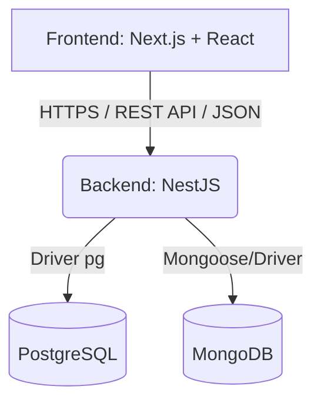

# Arquitetura do Sistema: FarmaSystem

Este documento descreve a arquitetura técnica adotada para o FarmaSystem, dividida em camadas, componentes e tecnologias principais. A arquitetura foi elaborada garantindo aderência à documentação do Swagger fornecida e especificações de interface gráfica.

## Visão Geral

O sistema segue o modelo **Cliente-Servidor** comunicando-se exclusivamente via **API REST** através do protocolo HTTPS.
A aplicação é dividida em dois grandes blocos independentes:
- **Frontend (Client-side)**: Desenvolvido em Next.js e React.
- **Backend (Server-side)**: Desenvolvido em NestJS (Node.js).

## Diagrama de Integração



## 1. Arquitetura do Backend (NestJS)

A arquitetura do backend seguirá os princípios modulares do framework **NestJS**, focado na injeção de dependências e separação clara de responsabilidades (SOLID). A aplicação garantirá transações cruciais com SQL Puro via repositórios específicos.

### 1.1. Camadas da Aplicação (Layered Architecture)
- **Controllers (`*.controller.ts`)**: Responsáveis exclusivamente por receber as requisições HTTP, delegar a lógica para os Services e retornar a resposta adequada baseando-se no contrato do Swagger (status codes, JSON).
- **Services (`*.service.ts`)**: Onde a lógica de negócio principal, validações avançadas e orquestração acontecem. É o núcleo das operações do sistema.
- **Repositories (`*.repository.ts`)**: Camada abstrata de acesso a dados. É aqui que escreveremos **Consultas SQL Puras** utilizando o driver `pg` (node-postgres) para PostgreSQL. 
- **DTOs (Data Transfer Objects)**: Classes utilizadas para tipar e validar os dados de entrada (payloads de criação) e saída, utilizando bibliotecas embutidas do Nest como o `class-validator` para validar regras na porta de entrada da requisição.

### 1.2. Bancos de Dados

#### PostgreSQL (Banco Relacional Primário)
Será utilizado para armazenar todos os dados estruturados e relacionais do sistema, refletindo a modelagem de negócios complexa.
- Controle de Estoque e alertas.
- Operações atômicas de Registro de Venda e Caixas.
- Autenticação, Usuários, Clientes, Fornecedores e Receitas.
- *Decisão Técnica*: Consultas executadas com raw SQL (sem ORM) para controle fino, viabilizando operações seguras de *Commit/Rollback* em cenários críticos (exemplo: ao registrar uma venda, múltiplos lotes precisam dar baixa atômica).

#### MongoDB (Banco NoSQL Secundário)
Trabalhará paralelamente como um banco orientado a documentos (arquivos).
- Responsável por salvar mídias pesadas através do formato GridFS ou de buffers.
- Armazenamento de Imagens de perfil/medicamentos.
- Armazenamento de Bulas de medicamentos (PDFs).

### 1.3. Segurança e Controle de Acesso (RBAC)
- **Autenticação**: O backend emite **JSON Web Tokens (JWT)**.
- **Autorização (RolesGuard)**: Implementação de um Guard customizado para as rotas. Ele irá ler os tokens JWT, determinar a identidade (Administrador, Farmacêutico, Atendente) e comparar com o metadado da rota acessada, bloqueando (HTTP 403) ou permitindo o acesso de acordo com a Matriz de Permissões estabelecida pelo sistema.

---

## 2. Arquitetura do Frontend (Next.js)

O frontend foi arquitetado visando a reusabilidade de componentes e separação explícita entre camada visual (UI) e a gestão de estados de negócio.

### 2.1. Estrutura de Diretórios
A estrutura adotará o isolamento de lógicas visuais e regras de domínio seguindo o padrão App Router e Componentização:

```text
src/
├── app/               # Rotas e páginas principais (ex: /dashboard, /vendas, /login)
├── components/        # Componentes reutilizáveis
│   ├── layout/        # Estruturas base: Sidebar, Header, Modais genéricos
│   ├── ui/            # Botões, Table, TextInput, SelectInput baseados no Tailwind
│   └── [domain]/      # Componentes do domínio (ex: SalesSummary, StockAlert)
├── context/           # Estados globais específicos compartilhados pela Context API
├── hooks/             # Custom hooks (ex: useAuth, useDebounce, usePagination)
├── redux/             # Store global da aplicação e slices complexos
├── services/          # Integração HTTP (Axios), interceptors de auth e chamadas REST
├── styles/            # Tailwind global e classes de personalização CSS
└── types/             # Tipagem TypeScript de entidades como Medicamento, Venda, Usuario
```

### 2.2. Gerenciamento de Estado Híbrido
A aplicação fará uso de uma abordagem mista para acomodar diferentes necessidades:
- **Redux**: Otimizado para estados globais ou frequentes que necessitam ser amplamente distribuídos pela aplicação (ex: Cache do perfil de usuário logado).
- **Context API**: Ideal para fluxos muito específicos e compartilhados dentro de partes menores da árvore de componentes (ex: Contexto de Finalização de Compra/Carrinho).
- **Estado Local (`useState`/`useReducer`)**: Para controle restrito da visão de componentes (ex: abas selecionadas, toggle de sidebar, preenchimento parcial de formulários).

### 2.3. Integração com a API REST
- Toda requisição ao Backend é feita por meio do pacote **Axios** em uma instância configurada globalmente em `services/api.ts`.
- **Interceptors**: 
  - *Request*: Injeta o header `Authorization: Bearer <token>` de modo invisível aos componentes em toda requisição protegida.
  - *Response*: Escuta respostas **HTTP 401 Unauthorized**. Caso a sessão expire, tentará de forma automática enviar um pedido a `/auth/refresh` com o token de renovação, atualizando-o e retomando a requisição original. Se falhar, realiza o log-out completo para a tela inicial.

## 3. Resumo de Diretrizes Adicionais
- **Responsividade e Design**: A UI deve utilizar estritamente o TailwindCSS (abordagem utility-first). Estilos complexos ou cores customizadas podem ser mapeados no `tailwind.config.js`.
- **Validação de Entrada**: O Frontend aplicará validações sintáticas prévias a submissão (ex: mínimo de caracteres, formato de e-mail).
- **Proteção Visual**: Páginas e botões restritos a determinados perfis (`Admin`) nem chegarão a ser renderizados no DOM caso o usuário atual (`Atendente`) não possua tal função, complementando o bloqueio primário imposto na API.
